<h1 align="center">
    
</h1>

# ignite-react-chapter01

### Trilha ReactJS

## Fundamentos do ReactJS

### 1 Criando estrutura do projeto

## 1 Configurando Ambiente:

1.1 Vamos criar o arquivo package.json

```yarn init -y``` 

Vamos instalar a biblioteca react

```yarn add react```

Vamos instalar a biblioteca react-dom
E a arvore de elemento da nossa aplicação. em outras palavras e o HTML convertido em sintasse de objeto como javascript.
Permitido que react se comunique com a arvore de elementos do HTML.

```yarn add react-dom```

Agora vamos criar as estrutura de pastas do projeto
Pasta na raiz do projeto:
  src
  
Pasta na raiz do projeto:
  public

Onde vai ficar os aquivos publicos que precise ser acessado do meio externo.

Dentro do public:
  index.html

  E entramos digitando e selecionado html5, pois ele ja ira criar uma estrutura inicial.


### 2 Configurando Babel

Vamos configura o Babel, que tem a função de converter o codigo para que todos os Browser possa entender nossos códigos.

site: https://babeljs.io/

Vamos instalar a Babel, como dependencia de desenvolvimento:

```yarn add @babel/core @babel/cli @babel/preset-env -D```

Despois de instalado vamos criar um arquivo na raiz do projeto:
  babel.config.js

<h1 align="center">
    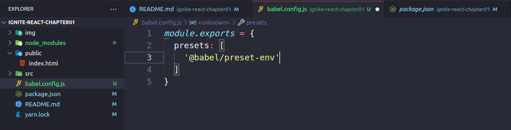
</h1>


Agora na pasta src, vamos criar um aquivo: `index.js`

E escrever o seguinte código:

<h1 align="center">
    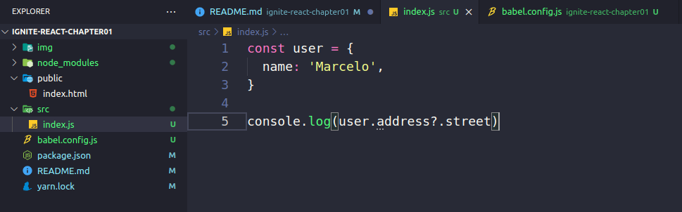
</h1>

E vamos execulta:

```yarn babel src/index.js --out-file dist/bundle.js```

<h1 align="center">
    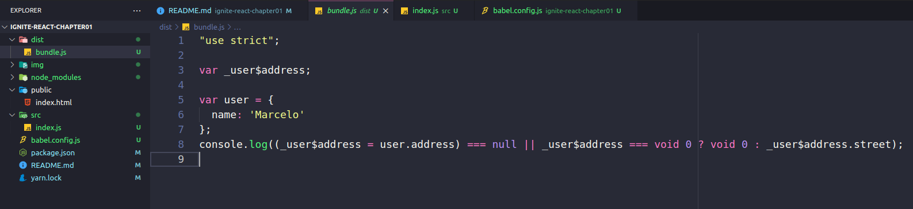
</h1>

O mesmo codigo gerado dentro do site do Babel.

Vamos instalar a biblioteca @babel/preset-react -D como dependencia de desenvolvimento:

```yarn add @babel/preset-react -D```

E dentro do babal.config.js adicionar uma nova linha.

<h1 align="center">
    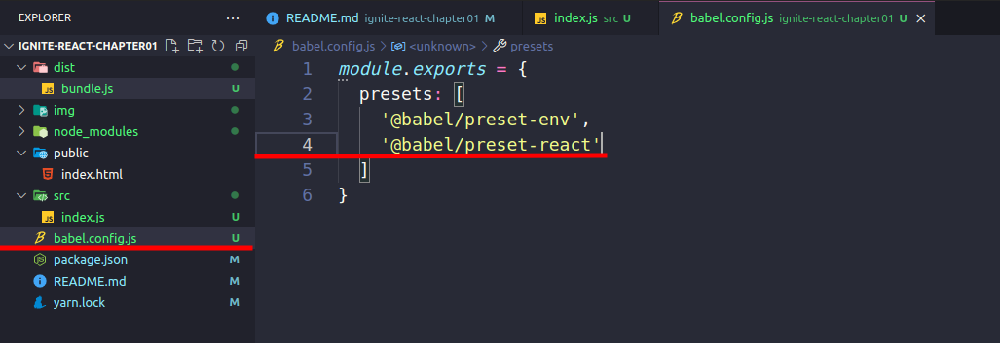
</h1>

E vamos execulta.

```yarn babel src/index.js --out-file dist/bundle.js```


vamos trasformar a extenção do nosso arquivo index.js em index.jsx
E porque jsx? Porque e quando ultilizamos HTML dentro do JavaScript

```yarn babel src/index.jsx --out-file dist/bundle.js```

### Configurando Webpack

Vai ensina atraves de uma serie de configurações que se chama loaders em nossa aplicação como ela deve tratar cada tipo de arquivo seja .js, .sass, .png, 
Ai o webpack vai tranforma os aquivos em uma forma que sera entendido pelo Browser.

Vamos instalar Webpack

```yarn add webpack webpack-cli webpack-dev-server -D```

Vamos criar na raiz do projeto um aruivo de configuração webpack.config.js
Vamos usar o `require` pois o node consegue intender ele desta forma ele vai colocar o caminha conforme o sistema operacional.

<h1 align="center">
    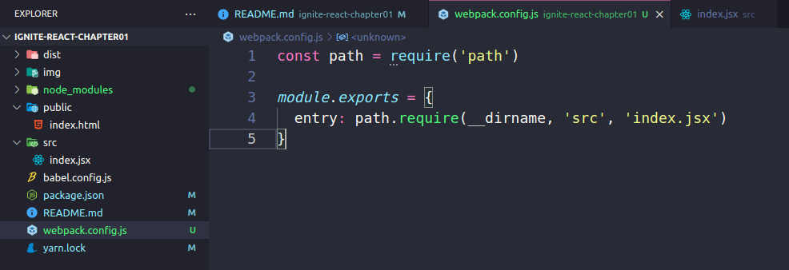
</h1>

E vou configura o caminho e que tipo de aquivo ele ira ler em uma expressão regular:

<h1 align="center">
    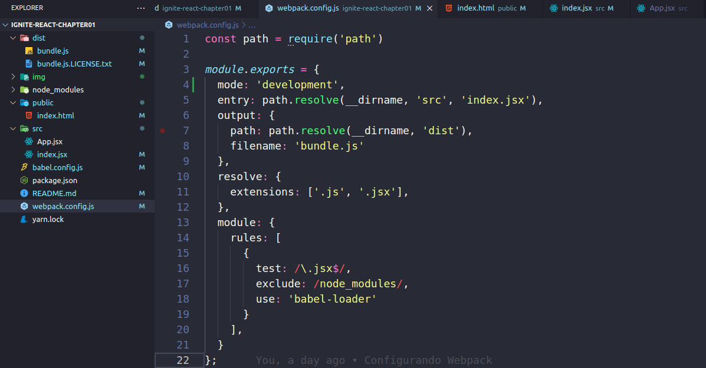
</h1>

Vamos instalar babel-loader como dependencia

```yarn add babel-loader -D```

Que ira fazer a integração entre o `loader` e `webpack`

Agora apenas para testar o codigo se já esta funcionado, vamos criar dentro src/ um arquivo App.jsx

<h1 align="center">
    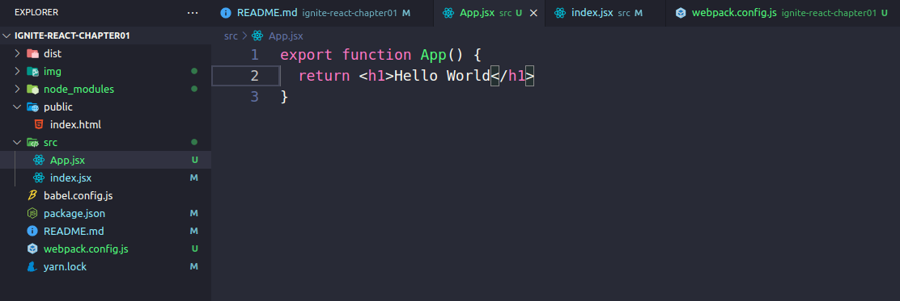
</h1>

E no arquivo index.jsx, vamos fazer as senguintes importações:

<h1 align="center">
    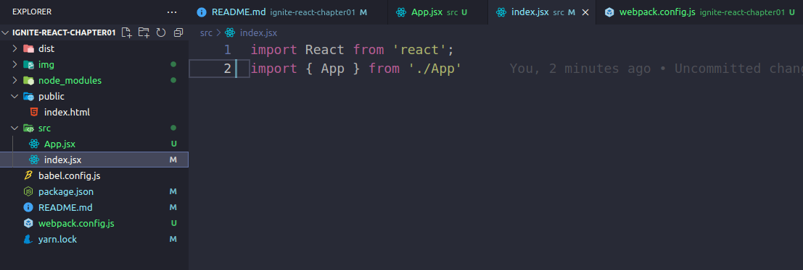
</h1>

E vamos execulta o webpack no terminal:

```yarn webpack```

E se acessa a pasta dist ele geral em nosso `bundle.js` o nosso novo aquivo.


### Estrutura do ReactJS

O React tem a finalidade de criar toda a interfeice da aplicação atraves do javascript.

E vamos colocar dentro do arquivo index.html o seguinte codigo dentro do `body` ai toda a aplicação react sera contruida dentro da div.

```
<body>
  <div id="root"></div>  
</body>
```

E dentro do arquivo index.jsx mais fazer a seguinte alteração, para teste:
Onde o `getElementById` vai procura dentro da aplicação pelo id, que nesse caso e root.

<h1 align="center">
    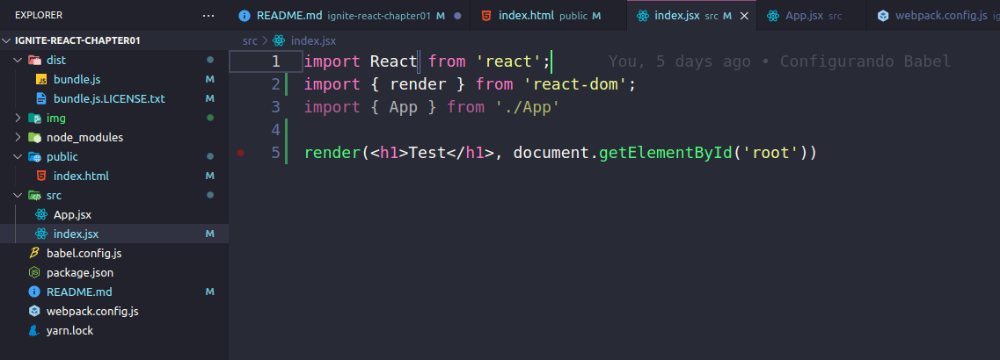
</h1>

E vamos execulta o comando:

```yarn webpack```

E dentro do arquivo `index.html` adicionar o script:

<h1 align="center">
    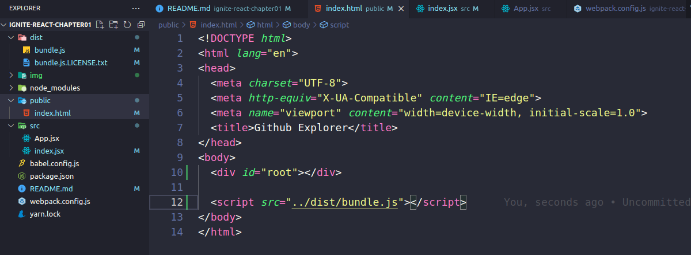
</h1>

E vamos abri o arquivo html

Mas pra não precisa import o React dentro `index.jsx`,vamos fazer uma alteração no arquivo `babel.config` e adicionar o seguinte codigo: `runtime: 'automatic'`

<h1 align="center">
    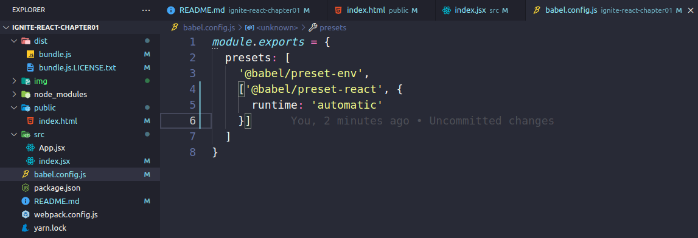
</h1>

E vamos execulta o comando:

```yarn webpack```

E posso tambem busca as informações dentro do `App.jsx`

<h1 align="center">
    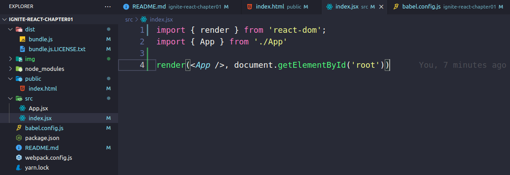
</h1>

Assim conseguimos intender como ele funciona.

### Servindo HTML estático

Uma melhoria que podemos fazer em nosso codigo html para não fica com a tag ` <script src="../dist/bundle.js"></script>`:
Vamos removela do codigo.

<h1 align="center">
    
</h1>

E instalar:

```yarn add html-webpack-plugin -D```

E dentro do arquivo `webpack.config.js`, mais importa ele.
Vamos adicionar o seguinte codigo: 

```const HtmlWebpackPlugin = require('html-webpack-plugin')```

E tambem:

```
plugins: [
    new HtmlWebpackPlugin({
      template: path.resolve(__dirname, 'public', 'index.html')
    })
  ],
```

<h1 align="center">
    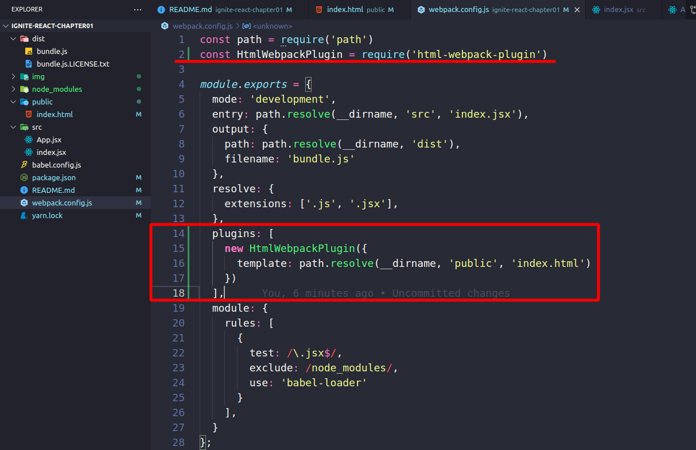
</h1>

E vamos execulta o comando:

```yarn webpack```

Ele ira gera um arquivo html dentro da pasta `dist`
Assim melhoramos o fluxo da aplicação.

### Webpack Dev Server

Vamos instalar webpack-dev-server como dependencia

```yarn add webpack-dev-server -D```

E vamos configura dentro do arquivo `webpack.config` uma variavel `devServer` para ele ficar escultado cada alteração na aplicação:

<h1 align="center">
    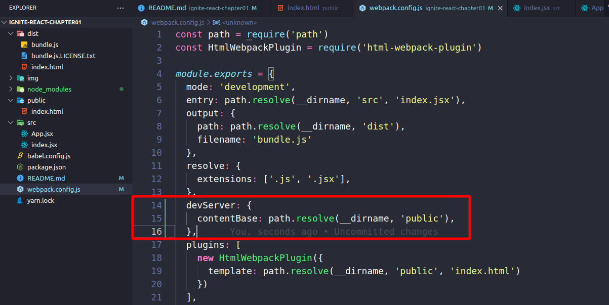
</h1>

E vamos execulta o comando:

```yarn webpack serve```

Dica: Caso não fucione sera nescessario mudar a versão da instalação do `yarn add webpack-dev-server -D` = `"webpack-dev-server": "^4.11.1"` para: `"webpack-dev-server": "3.11.2"`.

E vamos execulta o comando:

```yarn add webpack-dev-server@3.11.1```

E vamos execulta o comando:

```yarn webpack serve```

<h1 align="center">
    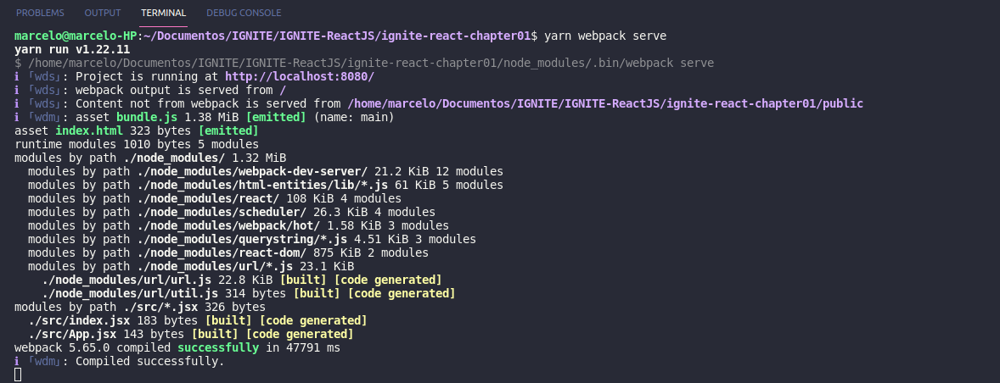
</h1>

Agora todas as vezes que for salvo uma alteração no codigo ele vai gera um `bundle`

### Utilizando source maps
## Importante:
Configura uma funcionalidade chamada source maps, que e uma forma de visualizar o codigo original da nossa aplicação mesmo quando ele está no `bundle.js`. Que ira ajudar quando for encontra o erro.

Vamos no arquivo `webpack.config.js`, e acrecentar a seguinte linha no codigo:

```
devtool: 'eval-source-map',
```

<h1 align="center">
    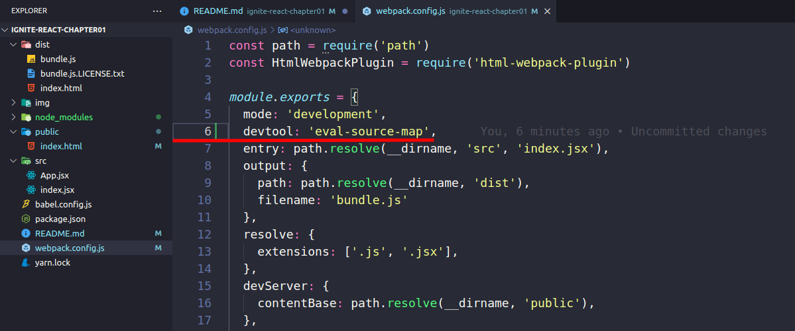
</h1>

Pauso o webpack `Ctrl + C`

E vamos execulta o comando:

```yarn webpack serve```

### Ambiente dev e produção

Vamos configura um ambiante de desenvolmineto e um de produção.
E dentro do aquivo `webpack.config.js`, e acrecentar a seguinte linha no codigo:

```const isDevelopment = process.env.NODE_ENV !== 'development';```

```mode: isDevelopment ? 'development' : 'production',```

```devtool: isDevelopment ? 'eval-source-map': 'source-map',```

<h1 align="center">
    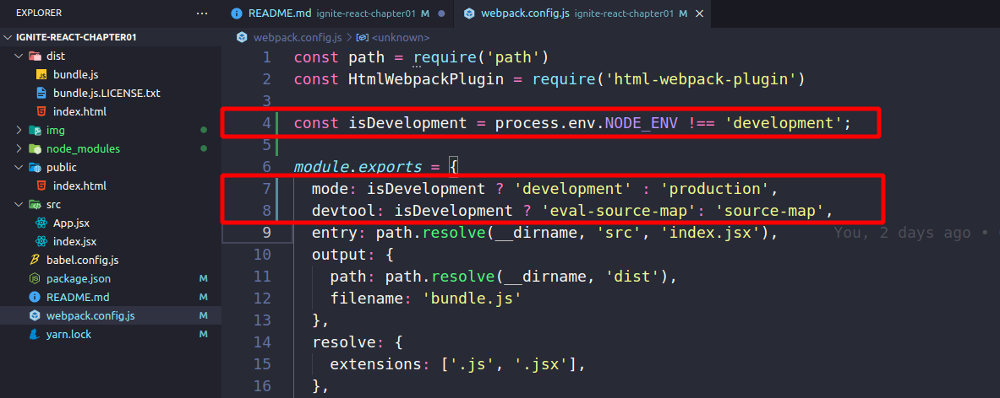
</h1>

Para execulta a aplicação:
Mac e Linux

```NODE_ENV=production yarn webpack```

No windows
Vamos precisa instalar uma variavel de ambiente e funciona para definir variavel de ambiente independe do sistema:

```yarn add cross-env -D```

E dentro do arquivo `package.json` adicionar encima das dependencias alguns scripts:
Um script para ambiente de desenvolmineto:

```"dev": "webpack serve",```

Um script para ambiente de produção:

```"build": "cross-env NODE_ENV=production webpack"```

<h1 align="center">
    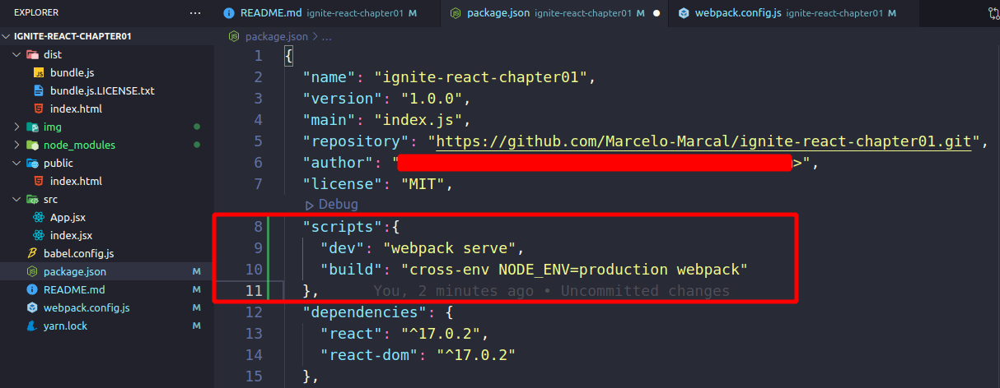
</h1>

Salva

E vamos execulta o comando para ambiente de desenvolmineto:

```yarn dev```

E vamos execulta o comando para ambiente de produção:

```yarn build```

### Importando arquivos CSS

Vamos criar uma pasta `styles` e dentro dela um arquivo `global.css`.

<h1 align="center">
    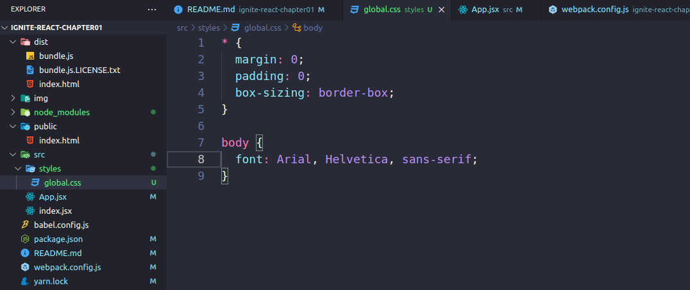
</h1>

E dentro do App vamos importa o arquivo:

`import './styles/global.css'`

E dentro do arquivo `webpack.config.js` vamos criar uma nova regra para que ele possa ler arquivos css.

<h1 align="center">
    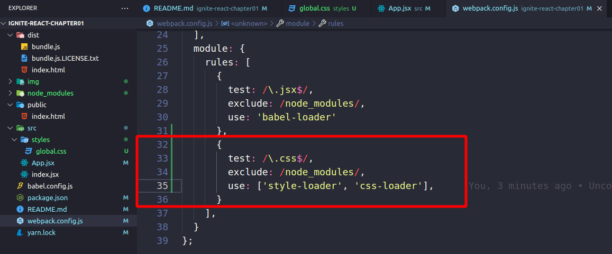
</h1>

E estalar dois loaders:
Vamos instalar o `style-loader` e `css-loader` como dependencia

```yarn add style-loader css-loader -D```

E vamos execulta o comando:

```yarn dev```

### Utilizando SASS

Que vem ser um pre processador, que nos da algumas funcionalidades a mais no projeto.

Vamos instalar o `sass-loader` como dependencia.
Para entender arquivos sass

```yarn add sass-loader -D```

```yarn add node-sass -D```

Se precisa desistalar:

```yarn remove sass```

E dentro do arquivo `webpack.config.js` vamos alter a nova regra para que ele possa ler arquivos.

<h1 align="center">
    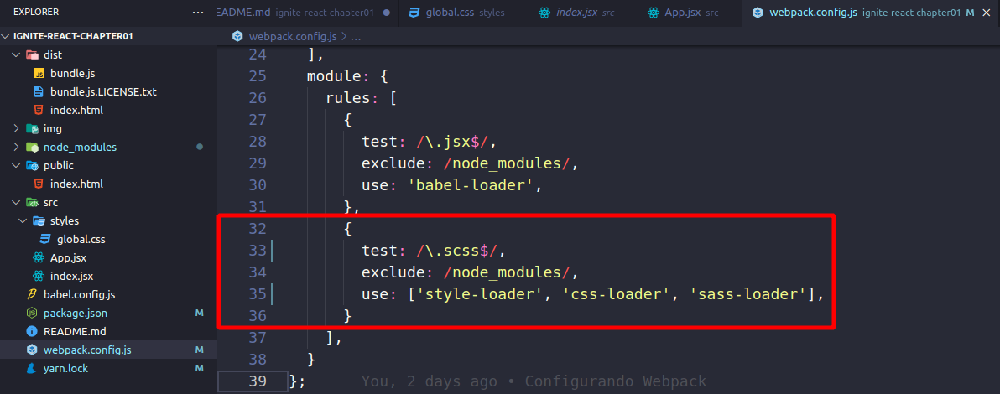
</h1>

Troco arquivo `global.css` para `global.scss`.

E no arquivo `App.jsx`
Troco arquivo `import './styles/global.css';` para `import './styles/global.scss';`.

E vamos execulta o comando:

```yarn dev```

Fim da Configuração de Ambiente:

## 2 Conceitos Importantes:

### Primeiro componente React

Criar pasta components dentro src:

E dentro da pastqa um arquivo `RepositoryList.jsx`

E vamos contruir nosso componente.
<h1 align="center">
    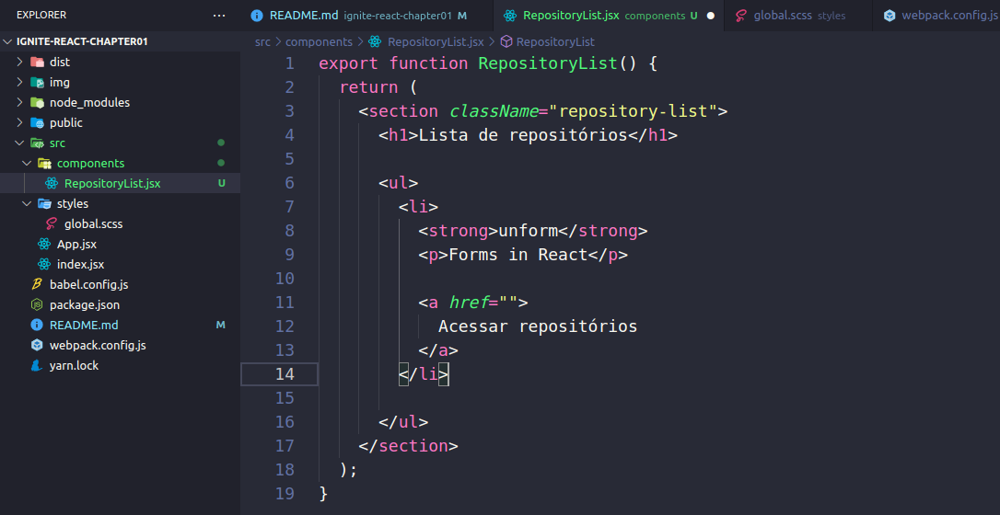
</h1>

E vamos altera o arquivo `App.jsx`
<h1 align="center">
    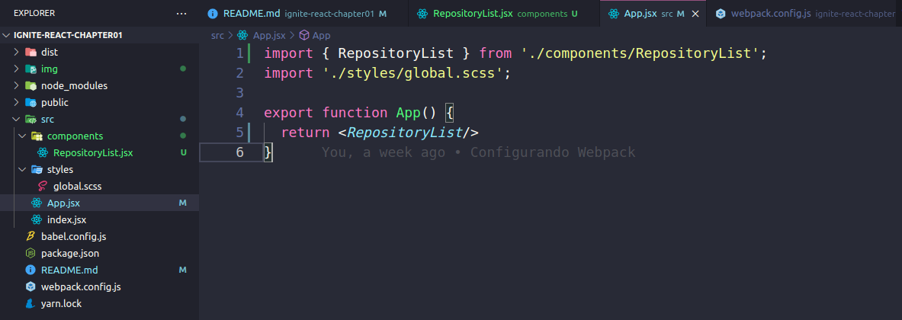
</h1>

E fazer uma pena alteração no stilo dentro do arquivo `global.scss`.
<h1 align="center">
    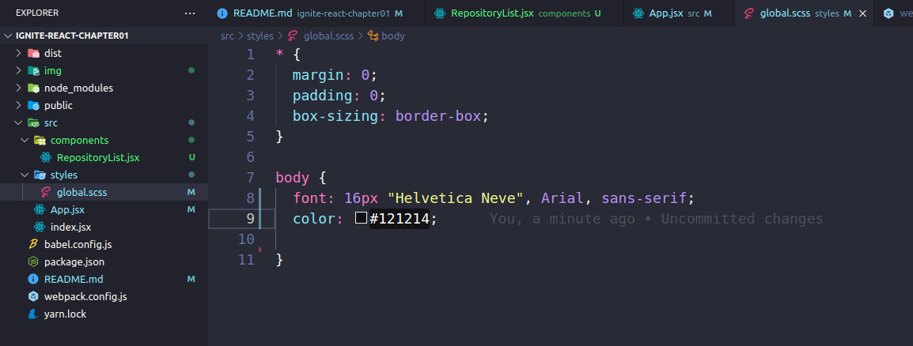
</h1>

E vamos execulta o comando:

```yarn dev```

### Propriedades no React

Os tres conseitos basico do react: Componete, Propiedade e Estado

Vai criar um arquivo `RepositoryList.jsx` com essa estrutura:

<h1 align="center">
    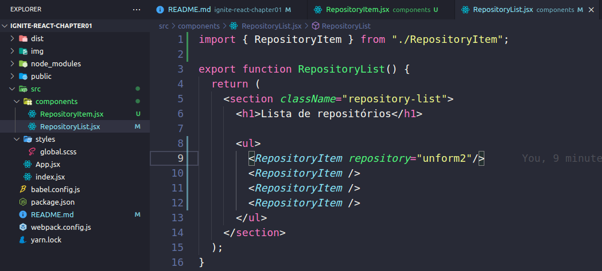
</h1>

E para acessa o componete eu vou usa um argumento `props` e chamar a propriedade que tem o nome `repository` eu acesso o `props` com o nome `{props.repository}` onde as chaves representa uma variavel javascript dentro do html.

E dentro do arquivo `RepositoryItem.jsx`  
<h1 align="center">
    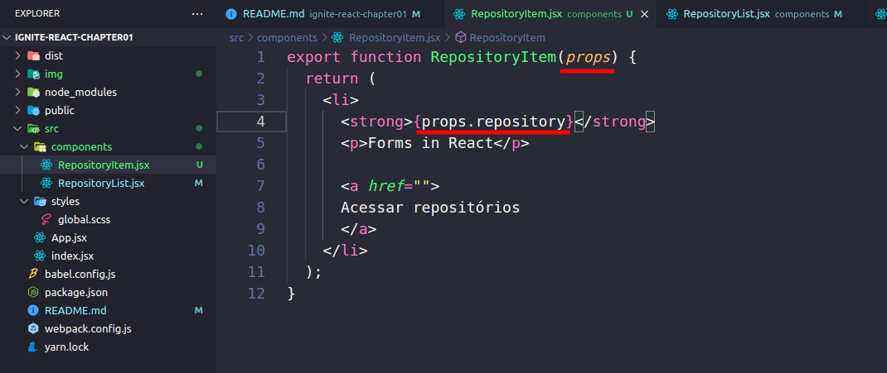
</h1>

Sendo possivel fazer uma verificação dentro do repositorio.
Caso o repositorio esteja vazio `??` ele me retorna um nome: tipo Default
<h1 align="center">
    
</h1>

`??` = e parecedo com o sinal `||` que e ou, mais essa nova funcionalidade Desconsidera que o zero e um valor invalido.

Seguindo pode estrutura a lista com as informações para o `RepositoryItem` no `RepositoryList` da seguinte forma.
<h1 align="center">
    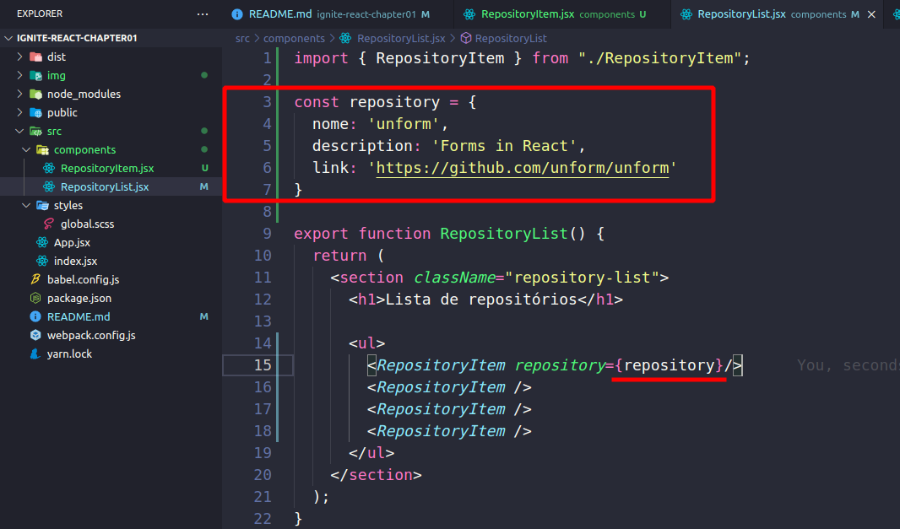
</h1>

E dentro do arquivo `RepositoryItem.jsx` e para poder acessa o nome do reposito eu vou adiciona `?.nome` onde o `?` vai verifica com o repositorio está nulo ou não, e estive nulo ele não ira procura e retorna logo o Default.
<h1 align="center">
    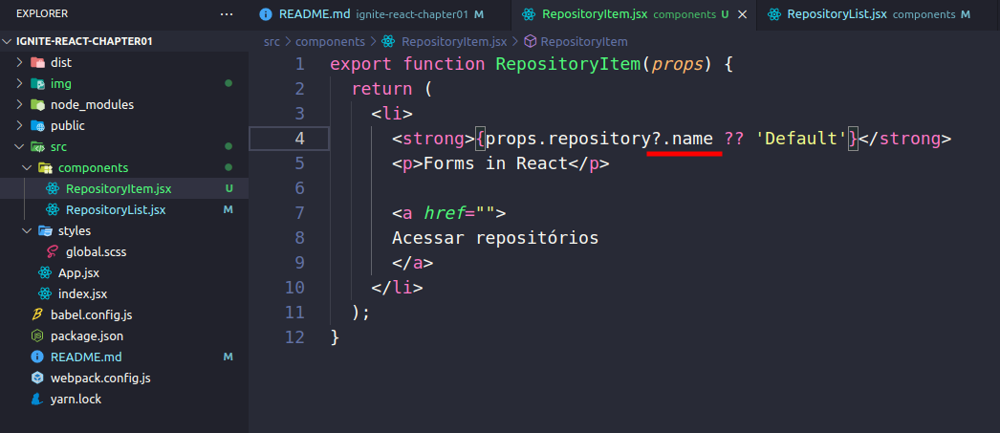
</h1>

Outra forma de resolver e colocar o `repository={repository}` em todos eles.
<h1 align="center">
    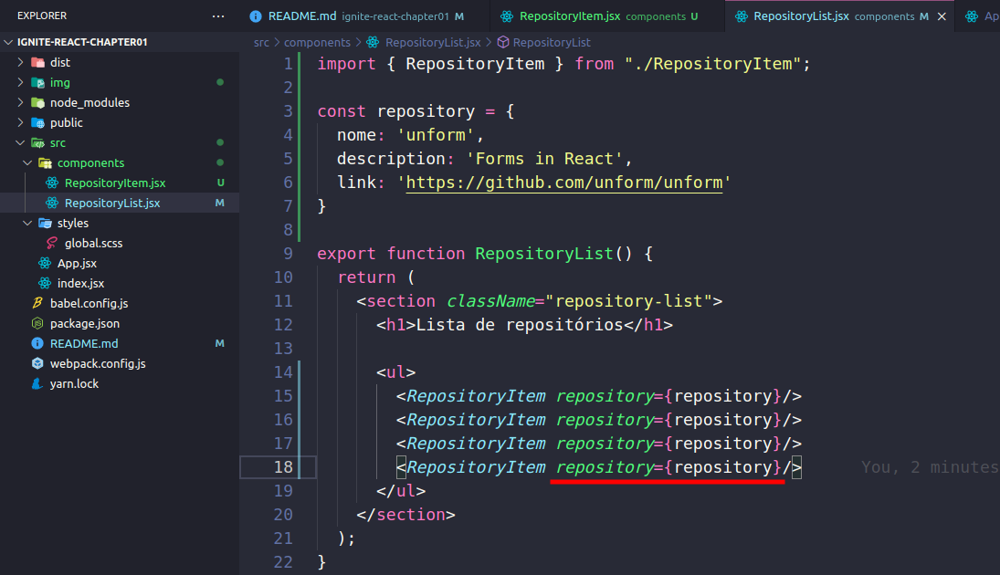
</h1>

E dentro do arquivo `RepositoryItem.jsx` vamos uses as outras informações:
<h1 align="center">
    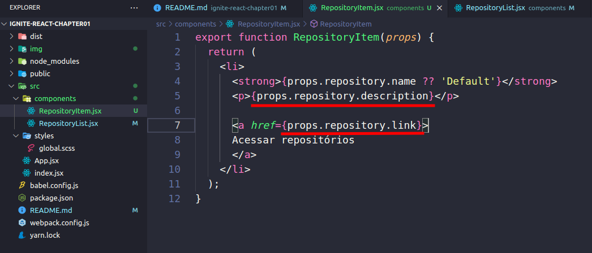
</h1>

### Estado do componente

Criar um componete para explicação:
Criar um arquivo `Counter.jsx` dentro da pasta components.

<h1 align="center">
    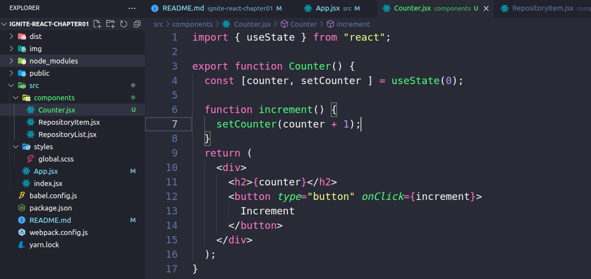
</h1>

`useState` Vai monitora e vai trazer atraves de um arrey

E no `App.jsx` vamos rederizar com as alterações:

<h1 align="center">
    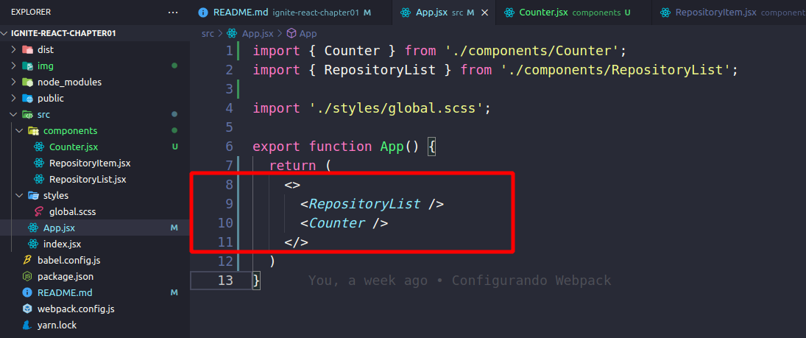
</h1>

### A imutabilidade no React

Conceito:
E que uma variavel nunca podera ter seu valor alterado, mais sim sempre ira receber um novo valor.

### Fast Refresh no Webpack

E uma forma de altera o codigo da aplicação e salvar, porem mantendo o estado do componete no Browse.

Vamos instalar React Refresh Webpack Plugin como dependencia

```yarn add -D @pmmmwh/react-refresh-webpack-plugin react-refresh```

E vamos no no arquivo `webpack.config.js`

E vamos importa `const ReactRefreshWebpackPlugin = require('@pmmmwh/react-refresh-webpack-plugin')`

E chamar ele somente em ambiente de desenvolvimento
<h1 align="center">
    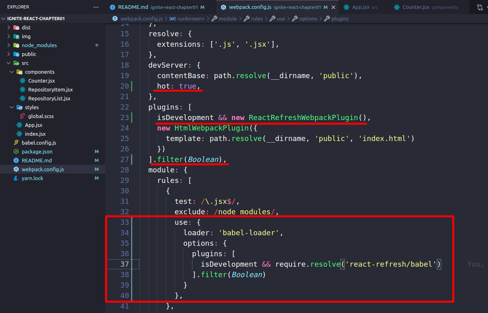
</h1>

`&&` Se eu estive em desenvolvimento ele ira execulta a segunda parte do if, e se não, ele ira retorna falso.
E para não gera error vamos usar `.filter(Boolean),` para tudo for falso ele remover o falso de dentro do if.

Vamos para `yarn dev` com `Ctrl + C`

E vamos rodar `yarn dev`

## 3 Chamadas HTTP:

### Estilização da listagem

Vamos apagar o arquivo `Counter.jsx` pois não ira ser usado.
No arquivo `App.jsx` vamos remover a parte do counter e deixa so o `<RepositoryList />`

E na pasta `styles` vamos criar um arquivo `repositories.scss` que vai ser a estilização dos repositorios.

Em no arquivo `RepositoryList.jsx` vamos importa `import '../styles/repositories.scss';`

E no arquivo `repositories.scss` vamos fazer alguns estilos.

<h1 align="center">
    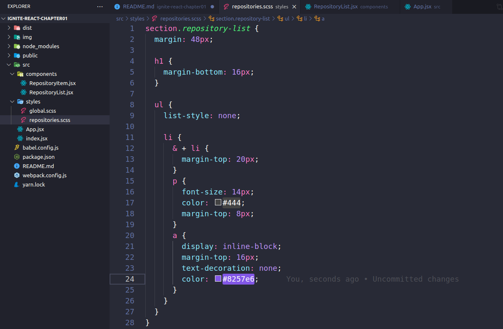
</h1>
